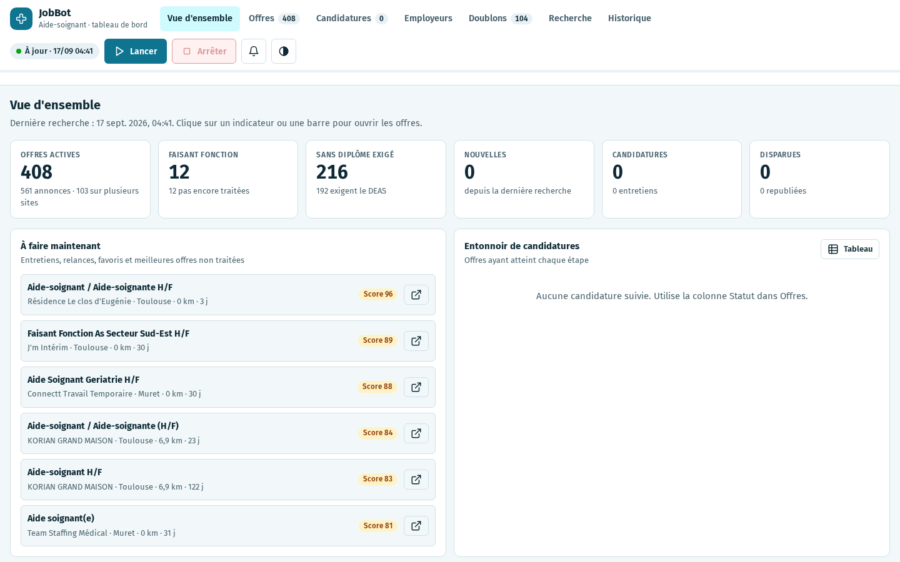
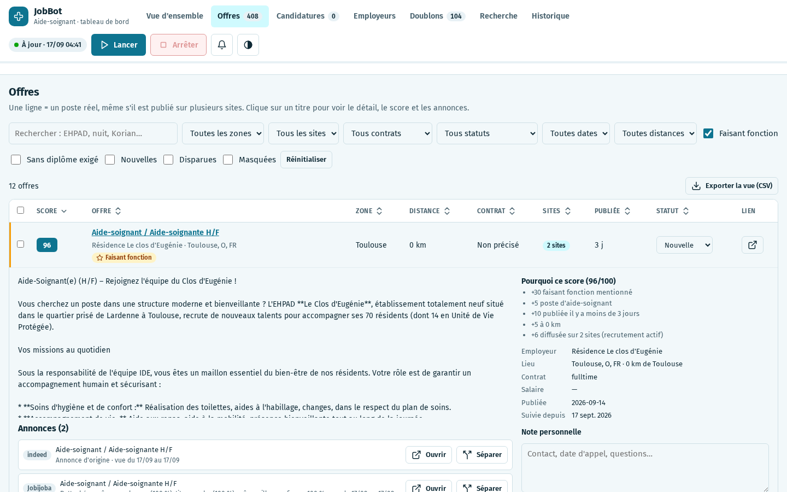
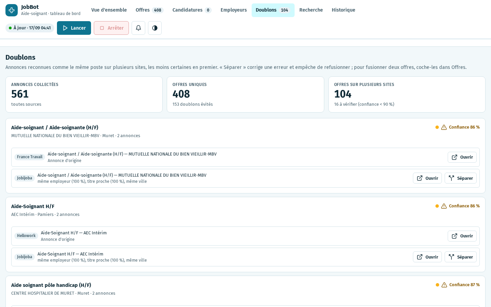
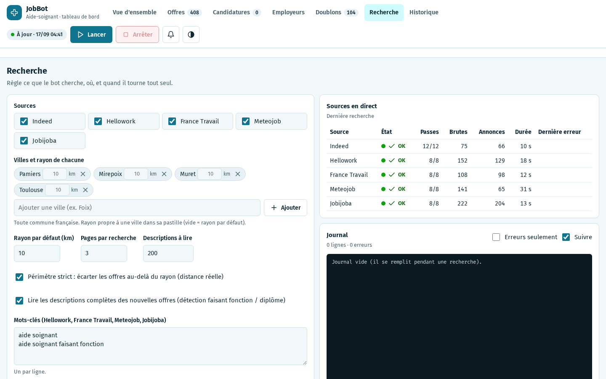
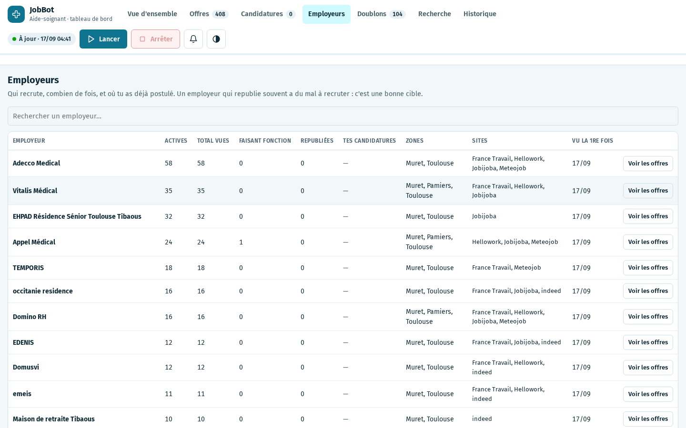
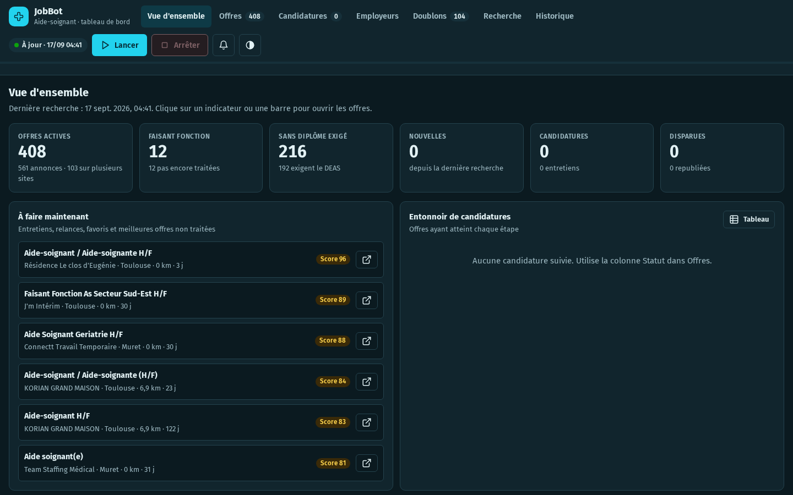
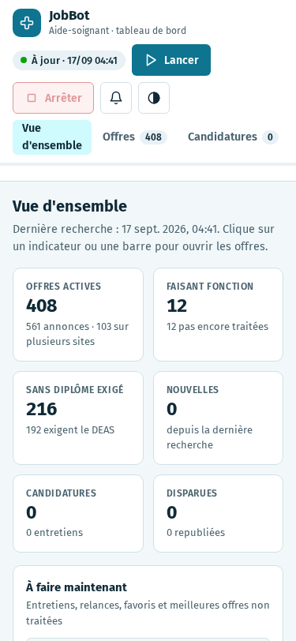
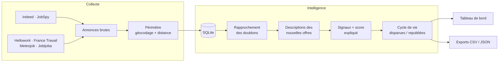

<div align="center">

# JobBot

**Le moteur de recherche d'emploi local et intelligent pour aides-soignants.**
Il interroge 5 sites d'emploi, reconnaît la même offre publiée partout, écarte ce qui est hors de ta zone,
repère les postes accessibles sans diplôme, et suit tes candidatures jusqu'à l'embauche.

[](https://github.com/kromz-dev/jobbot/actions/workflows/ci.yml)


[](LICENSE)



</div>

---

## Pourquoi JobBot ?

Chercher un poste d'aide-soignant, c'est ouvrir Indeed, Hellowork, France Travail, Meteojob et Jobijoba chaque jour,
retrouver 3 fois la même annonce, lire 40 descriptions pour savoir si le **DEAS est exigé**, et oublier à qui on a déjà écrit.
JobBot fait tout ça à ta place, en local, sans compte et sans IA générative : chaque décision est **explicable**.

| Problème | Ce que fait JobBot |
|---|---|
| Les mêmes offres sur 5 sites | **Dédoublonnage multi-critères** : une ligne = un poste réel, avec la liste de ses annonces et la raison du rapprochement |
| « Rayon 10 km » approximatif selon les sites | **Distance réelle** calculée (géocodage des communes) et périmètre strict par ville |
| DEAS exigé ou non ? | **Signaux métier** : faisant fonction, diplôme exigé, débutant accepté, nuit/jour, quotité, salaire mensuel |
| Quelles offres en premier ? | **Score 0-100 expliqué** (« +30 faisant fonction mentionné, +8 diffusée sur 3 sites… ») |
| L'offre a-t-elle été pourvue ? | **Cycle de vie** : nouvelle, toujours en ligne, disparue, republiée |
| « J'ai déjà postulé chez eux ? » | **Suivi des candidatures** (pipeline, notes, relances à 7 jours) et alerte employeur déjà contacté |
| Relancer la recherche chaque matin | **Recherche automatique** programmable + notifications navigateur |

## Fonctionnalités

- **5 sources** : Indeed (via JobSpy), Hellowork, France Travail, Meteojob, Jobijoba, sans clé API.
- **Base SQLite** : offres, annonces, recherches, historique des statuts. Rien n'est perdu d'une recherche à l'autre.
- **Collecte incrémentale** : seules les descriptions des *nouvelles* offres sont téléchargées.
- **Tableau de bord web** (local) :
  - *Vue d'ensemble* : indicateurs cliquables, « à faire maintenant », graphiques (apport de chaque site, zones, dates, contrats, employeurs, entonnoir).
  - *Offres* : tableau triable/filtrable (zone, site, contrat, distance, sans diplôme, nouvelles, disparues…), détail avec score expliqué, annonces liées, note personnelle, actions groupées, export CSV.
  - *Candidatures* : pipeline Favori → Postulé → Relancé → Entretien → Offre / Refusé.
  - *Employeurs* : qui recrute, qui republie (difficile à pourvoir = bonne cible), où tu as déjà postulé.
  - *Doublons* : revue des rapprochements triés par confiance, **séparer** une erreur ou **fusionner** deux offres.
  - *Recherche* : sources, villes et rayon par ville, mots-clés, pages, planification, santé des sources en direct, journal.
  - *Historique* : évolution des offres et bilan de chaque recherche.
- Thème clair/sombre, accessible au clavier, lisible sur mobile. Graphiques à palette validée daltonisme, avec vue tableau.

<details>
<summary><b>Captures d'écran</b></summary>

| Offres (détail, score expliqué, annonces liées) | Doublons |
|---|---|
|  |  |

| Recherche (pilotage) | Employeurs |
|---|---|
|  |  |

| Thème sombre | Mobile |
|---|---|
|  |  |

</details>

## Démarrage rapide

```bash
git clone https://github.com/kromz-dev/jobbot.git
cd jobbot
python -m venv .venv && source .venv/bin/activate   # Windows : .venv\Scripts\activate
pip install -e .

jobbot            # ouvre le tableau de bord sur http://127.0.0.1:8765
```

Puis clique sur **Lancer**. Une première recherche prend quelques minutes.

Autres commandes :

```bash
jobbot scrape     # une recherche complète en ligne de commande (utile en tâche planifiée / cron)
jobbot apply      # ouvre les meilleures offres une par une dans le navigateur
python -m jobbot  # équivalent de « jobbot »
```

> Python 3.10 à 3.12 recommandé (`python-jobspy` fixe `numpy==1.26.3`).

## Configuration

Tout se règle depuis l'onglet **Recherche** (enregistré dans `data/config.json`) :

| Paramètre | Défaut | Rôle |
|---|---|---|
| `sources` | les 5 | Sites interrogés |
| `cities` | Pamiers, Mirepoix, Muret, Toulouse | Villes de recherche (toute commune française) |
| `radius_km` / `city_radius` | 10 km | Rayon par défaut / propre à une ville |
| `strict_radius` | oui | Écarte les offres au-delà du rayon (distance réelle) |
| `source_terms`, `indeed_terms` | aide soignant, faisant fonction… | Mots-clés |
| `max_pages` | 3 | Pages de résultats par recherche |
| `enrich`, `max_enrich` | oui, 200 | Lecture des descriptions complètes des nouvelles offres |
| `schedule` | désactivée, 6 h, pause 22 h–7 h | Recherche automatique |

Les données vont dans `data/` (modifiable avec la variable d'environnement `JOBBOT_DATA`). Ce dossier n'est jamais versionné.

## Comment ça marche



### Dédoublonnage

Deux annonces sont le **même poste** si elles sont dans la même commune et que :

1. **Garde-fous** : aucun conflit d'horaire (nuit/jour), de contrat (CDI/CDD/intérim), de quotité (50 %/70 %) ni de service
   (« SSIAD » ≠ « pôle handicap » chez un même employeur), comparés sur les *mots distinctifs* du titre ;
2. **puis** même employeur (similarité ≥ 88 %) et titre compatible, **ou** description quasi identique (≥ 90 %) quand l'employeur est masqué ;
3. **sur un même site**, seules les republications à l'identique sont fusionnées (les agences publient souvent plusieurs postes proches).

Chaque rattachement garde sa **raison** et sa **confiance**, visibles dans l'onglet Doublons. Une séparation manuelle est mémorisée
et empêche de refusionner.

### Score

Base 40, puis par exemple : `+30` faisant fonction mentionné · `+10` débutant / non diplômé accepté · `-35` DEAS exigé ·
`+10` publiée il y a moins de 3 jours · `+5` à moins de 5 km · `+3` par site de diffusion (recrutement actif) · `+5` republiée · `+3` CDI.
Pensé pour un profil *aide-soignant faisant fonction* ; les règles sont dans [`jobbot/intel.py`](jobbot/intel.py).

## Structure du projet

```
jobbot/
├── __main__.py     # CLI : jobbot [serve|scrape|apply]
├── server.py       # API HTTP + planificateur (stdlib, sans framework)
├── pipeline.py     # collecte → base → enrichissement → cycle de vie → exports
├── scraper.py      # orchestration multi-sources, filtres, configuration
├── sources.py      # scrapers Hellowork, France Travail, Meteojob, Jobijoba
├── geo.py          # géocodage (geo.api.gouv.fr) et distances
├── intel.py        # normalisation, signaux, salaire, score, comparaison d'annonces
├── db.py           # schéma SQLite, ingestion, doublons, suivi, exports
├── paths.py        # emplacement des données (data/ ou $JOBBOT_DATA)
├── auto_apply.py   # ouverture guidée des offres
└── web/            # tableau de bord (HTML/CSS/JS, Chart.js)
tests/              # pytest : intelligence métier et base de données
```

## Développement

```bash
pip install -e ".[dev]"
pytest            # tests
ruff check .      # lint
```

La CI GitHub Actions exécute le lint et les tests sur Python 3.11 et 3.12 à chaque push.

## Utilisation responsable

JobBot est un outil **personnel** de recherche d'emploi : il fait peu de requêtes, espacées, limitées à 2 simultanées par site.
Respecte les conditions d'utilisation des sites interrogés et n'utilise pas ce projet pour de la collecte massive ou commerciale.
Les données restent sur ta machine.

## Licence

[MIT](LICENSE)
